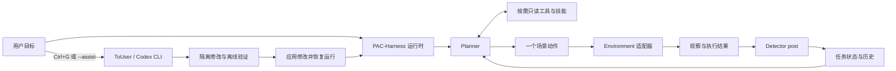

# PAC-Harness

项目名称与安装后的命令均为 `PAC-Harness`；Python 包名为 `pac_harness`（Python 导入标识符不能包含连字符），可运行 `python -m pac_harness`。当前本地目录仍为 `C:\Biology\Harness-Core`，下方命令沿用实际路径。

从现有 Harness 项目提取的通用三 Agent 运行框架。保留 **Planner → action → Detector post → Planner**、按需工具、任务状态、日志、记忆和主动 ToUser；具体场景通过独立适配器接入。

当前版本：**0.1.0，通用提取版**。这是可运行的基础框架；实际业务仍需实现动作与观察适配器、提供相应知识并验证效果。默认示例是本地列表排序，不代表模型已能自动操作任意业务系统。

## 环境准备（先完成这一步）

要求 **Python 3.11+**。建议使用虚拟环境，按“创建 → 激活 → 安装项目”的顺序执行，确保依赖安装在虚拟环境中。Windows 与 Linux 共用同一套源码。

### Windows（PowerShell）

```powershell
cd C:\Biology\Harness-Core
python -m venv .venv
.\.venv\Scripts\Activate.ps1
python -m pip install -e .
```

### Linux（Bash）

将路径替换为实际项目目录：

```bash
cd /path/to/PAC-Harness
python3 -m venv .venv
source .venv/bin/activate
python -m pip install -e .
```

创建环境和安装项目通常只需执行一次；以后打开新终端，进入项目目录后重新执行对应的激活命令即可。退出虚拟环境使用 `deactivate`。已有 Python 3.11+ 的 Conda 环境也可直接使用。

激活后，下文的 `python -m pac_harness ...` 命令在两个系统中相同；切换操作系统时需重新创建虚拟环境。

### 按功能准备依赖

| 功能 | 需要准备 |
|---|---|
| 离线演示、核心测试 | Python；无需模型密钥或设备 SDK |
| Planner / Detector 真实模型 | 模型连接配置与密钥环境变量，见下方“使用真实模型” |
| ToUser 终端 / 网页对话 | 本机可用的 Codex CLI 与登录/连接配置；Linux 修改验证另需 bubblewrap，见 [Linux 指南](LINUX.md) |
| 摄像头与机械臂 | 对应系统的驱动、SDK 和设备权限，见 [设备接入指南](DEVICES.md) |

### 两个系统有哪些操作差异？

运行参数、适配器接口、memory / skill 格式和网页用法相同；主要差异是环境准备与系统接口：

| 项目 | Windows | Linux |
|---|---|---|
| 项目路径 | `C:\Biology\Harness-Core` | 如 `/home/user/PAC-Harness` |
| 设置环境变量 | `$env:OPENAI_API_KEY = '<你的密钥>'` | `export OPENAI_API_KEY='<你的密钥>'` |
| 虚拟环境激活 | `.\.venv\Scripts\Activate.ps1` | `source .venv/bin/activate` |
| ToUser 离线验证 | Windows Codex 沙箱 | bubblewrap 与系统命名空间支持 |
| 设备接入 | Windows 驱动与 SDK | Linux 驱动、SDK、设备权限 |

终端热键和文件锁已在代码中按系统适配。硬件相关代码仍需在目标系统验收；Windows 的厂商二进制库不能直接当作 Linux 驱动使用。

## 快速运行

要求 Python 3.11+；核心和离线演示只使用标准库，无需模型密钥。Windows、Linux 均支持核心运行、文件锁、ToUser 隔离验证和本地 Web 工作台。

在上述项目目录及已准备的环境中执行（Windows / Linux 通用）：

```bash
python -m pac_harness --demo
python -m unittest discover -s tests -v
```

演示使用确定性 Planner/Detector 测试替身，将 `[4,1,3,2]` 排成 `[1,2,3,4]`，执行一次替换，再独立核对 `done`。它验证整个调用链，不用于评估模型智能。演示数据写入本项目 `logs/<run>/`。

恢复已有任务：

```powershell
python -m pac_harness --demo --run-dir logs/<实际运行目录> --resume
```

仅规划，不执行新动作：

```powershell
python -m pac_harness --demo --preview
```

新运行必须用新目录；恢复时核对原任务、项目和适配器配置。CLI 不允许用 `--preview` 恢复待后检动作，以免把一次恢复误称为纯预览。

## 架构



| 部分 | 作用 | 入口 |
|---|---|---|
| Planner | 按需调用信息工具，最终输出一个动作或真实完成声明 | `pac_harness/agents.py`、`prompts/planner.md` |
| Detector | 对照预期和结果，反馈进展、异常、未知及事实 | `prompts/detector.md` |
| ToUser | 用户主动请求分析、指导、修改代码或知识 | `pac_harness/to_user.py` |
| 执行调度 | 单步执行、后检重试、检查点恢复 | `pac_harness/runtime.py` |
| 场景适配器 | 定义观察、动作、执行和结果查询 | `pac_harness/contracts.py`、`examples/list_sorting.py` |
| 工具与证据 | 观察、历史、技能、按需读取文本或图像 | `pac_harness/tools.py` |
| 知识 | 共享事实、角色记忆、可选技能 | `memories/`、`skills/` |
| 审计 | 事件、检查点、修改差异和验证记录 | `logs/`、`maintenance/` |

没有 Detector pre。Agent 的只读工具不会通过核心调度执行动作；动作只从执行接口发送。适配器是可信代码，其验证方法负责参数以外的业务约束。核心不会替具体业务判断权限、可达性或有效操作。

## 使用真实模型

**接通模型不等于接通设备。** 使用设备需要完成模型连接、摄像头观察、机械臂动作适配与验证。默认列表排序示例不会自动打开相机或连接机械臂。

### 配置模型连接

复制 `config.json` 为 `config.local.json`，配置 Planner/Detector 的 `model` 和 `base_url`。密钥仅从 `api_key_env` 指定的环境变量读取，配置中不要写密钥。

```powershell
$env:OPENAI_API_KEY = '<你的密钥>'
python -m pac_harness --config config.local.json --task '将示例列表按升序排列'
```

Linux Bash 使用 `export` 设置同一个环境变量：

```bash
export OPENAI_API_KEY='<你的密钥>'
python -m pac_harness --config config.local.json --task '将示例列表按升序排列'
```


当前模型传输实现使用 Chat Completions 兼容接口与 JSON 工具协议：模型先返回 `tool_calls`，核心执行注册的只读工具、补回结果，再取得最终计划或报告。支持按需图像内容；所选模型必须支持对应输入和 JSON 模式。`reasoning_effort` 可选，允许值由提供方决定。新增模型供应商也可实现 `complete(messages) -> dict` 注入 `Agent`。

### 加入摄像头

普通 RGB 相机可使用新增的 `examples.camera_observation:create`。在项目配置的 `adapter.settings.cameras` 下，为每台相机填写唯一名称、`factory: "pac_harness.devices:opencv_camera"` 和 `settings: {"source": 0}`；第二台使用另一个名称及正确编号。完整可复制 JSON 见 [摄像头配置](DEVICES.md#1-普通-rgb-摄像头)。不要覆盖自己的模型配置。

```bash
python -m pip install opencv-python
python -m pac_harness --config config.local.json --observe-only
```

`--observe-only` 实际采集一轮图像并保存到 `logs/<run>/frames/`，不调用模型或动作。核对画面后再启动真实模型。示例将图片声明为观察中的 `artifacts`，模型才能通过 `inspect_artifact` 按需看图。深度或专用 SDK 相机通过自定义工厂接入；已有业务适配器使用 `CameraSet` 合并图像，不能直接换成只读示例而丢失原动作。

### 加入机械臂

每个机械臂需要自己的 SDK 工厂及场景动作实现。填写品牌/IP 不会自动产生控制能力。`pac_harness.devices.load_device()` 提供统一工厂入口，由业务适配器显式调用；工厂参数、单位转换、限位、执行结果与停止恢复必须实现并验收。参见 [机械臂接入步骤](DEVICES.md#3-机械臂)。先做只读状态和离线测试，再进行人工实机验收。

## ToUser

ToUser 用于讨论问题、分析代码、记录长期知识和构建 Skill。当前版本围绕当前项目工作，记忆保存在 `memories/`，可复用流程保存在 `skills/`；可参考 [Skill 模板](templates/SKILL.md)。

### 终端交互

Windows 或 Linux 前台交互终端按 **Ctrl+G** 请求 ToUser；请求在当前模型调用/动作的边界处理，不强行中断已经发送的动作。其他终端或任务停止后，可显式运行：

```powershell
python -m pac_harness --assist
python -m pac_harness --assist --run-dir logs/<实际运行目录>
```

ToUser 使用本机 `codex exec`，同次对话通过 `resume` 保持连续；继承模型连接设置，可用 `to_user.model`、`to_user.reasoning_effort`、`to_user.codex_path` 覆盖。它没有自动继承外部插件和服务权限。Windows 使用 Codex 的隔离验证命令；Linux 使用 bubblewrap 限制离线测试的写入范围与网络，沙箱不可用时拒绝应用修改。Linux 支持前台 TTY 的 Ctrl+G 进入和退出协助，详见 [Linux 使用指南](LINUX.md)。

它在隔离副本内查看源代码、当前上下文和声明的证据，编辑后由父进程进行语法检查、沙箱内离线测试、只读证据校验与并发修改校验。保存差异及备份后逐文件原子替换，遇错尝试回滚；这不是跨文件数据库事务，应用期间不应启动另一实例。测试数量必须大于零。

ToUser 按用户意图区分四种处理方式：

| 意图 | 实际行为 |
|---|---|
| 分析讨论 `analysis` | 检查相关文件和证据，解释原因；不声称做了没有发生的修改 |
| 本次指导 `task_guidance` | 仅影响当前任务，逐条去重并在输出确认前写入 `task_state.json.guidance` |
| 持久修改 `persistent_update` | 自主定位并修改 memory、skill、prompt 或代码；必须有真实文件差异并通过验证 |
| 返回任务 `return_to_task` | 真正结束对话；退出操作不写成 Planner/Detector 的任务指导 |

“以后不要这样”“修复这个反复出现的问题”“修改 memory”应落实为文件修改；“这一步先……”属于本次指导。缺少必要信息时可以追问。声称修改却没有 diff、候选文件语法错误或离线测试失败时，会把具体错误和测试输出交回同一个 Codex 会话自动修正，默认最多 **2 次**；可用 `to_user.max_repair_attempts` 设置为 0–3。连接错误、并发修改或应用/回滚失败不会进入该自动重写循环。修正仍失败时，显示错误和审计目录，保留未应用的候选文件。

成功应用修改后自动退出对话。仅更新 `memories/`、`prompts/`、`skills/` 中的知识文件时，两个任务 Agent 在后续调用中重新读取；Python（包括技能脚本）及其他源码修改触发运行中的 CLI 重启，并从原检查点恢复。已完成动作保留 `post_pending` 和 BEFORE，恢复后只补后检，不重复执行动作。独立 `--assist` 返回终端，由用户随后 `--resume`；网页协助不绑定正在运行的业务任务。

等待终端输入时，输入 `C`、`continue` 或在 Windows 控制台按 **Ctrl+G** 可直接退出，无需再按 Enter；自然语言要求“结束对话，继续任务”也会真正返回。Ctrl+G 返回键不取消正在进行的 Codex 推理或验证。Ctrl+C 结束运行时仍保存已收到的请求、对话和任务指导。每轮审计位于 `maintenance/to-user-*/`：`dialogue.json`、`report.json` 记录对话、已应用/未应用文件和退出原因；`turn-*/repair-*/` 保留各次自动修正的 diff 与验证结果，网页工作台也可查看。

未绑定运行任务的 `--assist` 或网页对话只将临时指导保存到审计，不会自动变成长久知识。每次 Ctrl+G 是独立对话，尚未实现跨会话自动检索历次讨论。这里的通用改进不包含任何特定设备的动作或对齐规则。

默认可编辑 `pac_harness/`、`examples/`、`adapters/`、`tests/`、`memories/`、`prompts/`、`skills/` 及顶层文本源码。可通过 `editable_roots` 加入业务源码目录。`config.json` 仅提供脱敏只读副本，`config.*.json` 不复制；原始证据、日志和凭据不作为可编辑文件。ToUser 不启动业务服务或执行实际业务操作。

### Web 交互界面

```bash
python -m pac_harness --web
```

打开终端输出的完整本机链接（包含访问令牌），直接与当前项目的 ToUser 对话。网页支持多行输入、草稿、连续对话、历史记录、修改差异和验证结果；端口冲突时使用 `--port 8766`。无需额外 Web 依赖，真实对话仍需本机 Codex CLI。详见 [ToUser 网页工作台](WORKBENCH.md)。

网页协助不绑定正在运行的业务任务；CLI 与网页协助共用项目锁。结束会话后，在终端启动或恢复任务。附件上传、Markdown 富文本及网页内任务暂停/恢复暂未接入。

不使用网页时，也可以直接发送需求：

```bash
python -m pac_harness --assist --message "请核对当前项目的设备信息，澄清缺项，并把确认知识写入 memories，将可复用流程写入 skills。"
```

`--message` 自动发送首条消息，`--task` 仅提供背景。临时讨论不会自动成为长期知识，需要实际修改文件并通过验证。

## 机械臂通用后端

基础运动接口已独立为 `pac_harness.robot_backends`，提供 `RokaeBackend`、`PiperBackend`、`FrankaFR3Backend` 和不接触硬件的 `SimRobotBackend`。Piper 使用场景侧注入 AgileX `piper_sdk` driver；FR3 使用 `libfranka`/`pylibfranka` driver。Core 不强制安装任何厂商 SDK，也不会自动连接或发送运动指令。接口、限位和实机接入步骤见 [ROBOT_BACKENDS.md](ROBOT_BACKENDS.md)。

以上厂商类目前是统一接口外壳，不是已完成的实机驱动映射；不能用模拟测试通过作为接入完成的依据。

代码不会把任务指令变成任意 shell 命令。动作只能来自适配器公布的目录；模型提出不存在的动作或无效参数时返回规划反馈。

## 版本管理

建议用 Git 管理当前项目的代码、提示词、记忆和技能；日志与密钥不提交。ToUser 的备份与 `changes.diff` 用于修改审计，不能替代整个项目的版本历史。当前没有自动 Git 提交、分支或版本回滚集成。

## 记忆与按需证据

- `memories/shared.md`：跨角色共享知识，初始为空白模板。
- `memories/planner.md`、`memories/detector.md`：通用规划和检查经验。
- `prompts/`：角色协议；每次模型轮开始重新读取。
- `skills/<name>/SKILL.md`：工具按需加载；核心不强制执行固定技能链。
- `task_state.json`：当前任务事实、最近历史、用户指导、最后动作和待后检状态。
- `events.jsonl`：完整运行事件，可由 `search_history` 查询。
- `references/`：可选证据目录，初始无场景素材。

观察可声明 `artifacts`，两个角色通过 `inspect_artifact` 自主选择文本或图像。图片按需作为真正的图像输入发送；日志保存路径和哈希，不反复存储 base64。其他媒体或专业数据由适配器提供读取工具。

## 恢复与能力边界

- 发送前持久化 `executing`；结果明确后进入 `post_pending`。
- 后检或观察失败仅重试检查，不重新执行已经完成的动作。
- 发送期间进程中断或结果不明时，进入 `execution_unknown`，恢复时只查询适配器的操作回执；未知结果不自动重放。
- 仅检查点不能保证外部副作用“恰好一次”。适配器需要持久回执、幂等键或可靠的结果查询。
- Detector 的 `verified` 表示单步效果；只有对 `done` 的完整任务验证才结束运行。
- 默认预算耗尽或模型连续失败会返回终端并保留检查点；不会自动打开 ToUser。
- 代码已通过离线测试和本地演示，未调用真实模型或业务服务进行验收。

提取来源、保留与剔除范围见 [EXTRACTION.md](EXTRACTION.md)；75 项离线测试和演示结果见 [VALIDATION.md](VALIDATION.md)。
