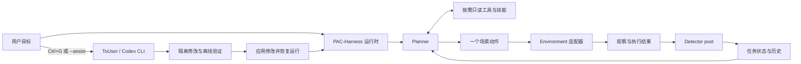

# PAC-Harness

项目名称与安装后的命令均为 `PAC-Harness`；Python 包名为 `pac_harness`（Python 导入标识符不能包含连字符），可运行 `python -m pac_harness`。当前本地目录仍为 `C:\Biology\Harness-Core`，下方命令沿用实际路径。

从现有 Harness 项目提取的通用三 Agent 运行框架。保留 **Planner → action → Detector post → Planner**、按需工具、任务状态、日志、记忆和主动 ToUser；具体场景通过独立适配器接入。

当前版本：**0.1.0，通用提取版**。这是可运行的基础框架；接入新场景仍需实现动作与观察适配器、提供相应知识并验证效果。默认示例是本地列表排序，不代表模型已能自动操作任意业务系统。

## 快速运行

要求 Python 3.11+；核心和离线演示只使用标准库，无需模型密钥。Windows、Linux 均支持核心运行、文件锁、ToUser 隔离验证和本地 Web 工作台。

```powershell
cd C:\Biology\Harness-Core
python -m pac_harness --demo
python -m unittest discover -s tests -v
```

演示使用确定性 Planner/Detector 测试替身，将 `[4,1,3,2]` 排成 `[1,2,3,4]`，执行一次替换，再独立核对 `done`。它验证整个调用链，不用于评估模型智能。演示数据写入本项目 `logs/<run>/`。

恢复已有任务：

```powershell
python -m pac_harness --demo --run-dir logs/<实际运行目录> --resume
```

仅规划，不执行新动作：

```powershell
python -m pac_harness --demo --preview
```

新运行必须用新目录；恢复时核对原任务、项目和适配器配置。CLI 不允许用 `--preview` 恢复待后检动作，以免把一次恢复误称为纯预览。

## 架构



| 部分 | 作用 | 入口 |
|---|---|---|
| Planner | 按需调用信息工具，最终输出一个动作或真实完成声明 | `pac_harness/agents.py`、`prompts/planner.md` |
| Detector | 对照预期和结果，反馈进展、异常、未知及事实 | `prompts/detector.md` |
| ToUser | 用户主动请求分析、指导、修改代码或知识 | `pac_harness/to_user.py` |
| 执行调度 | 单步执行、后检重试、检查点恢复 | `pac_harness/runtime.py` |
| 场景适配器 | 定义观察、动作、执行和结果查询 | `pac_harness/contracts.py`、`examples/list_sorting.py` |
| 工具与证据 | 观察、历史、技能、按需读取文本或图像 | `pac_harness/tools.py` |
| 知识 | 共享事实、角色记忆、可选技能 | `memories/`、`skills/` |
| 审计 | 事件、检查点、修改差异和验证记录 | `logs/`、`maintenance/` |

没有 Detector pre。Agent 的只读工具不会通过核心调度执行动作；动作只从执行接口发送。适配器是可信代码，其验证方法负责参数以外的业务约束。核心不会替具体业务判断权限、可达性或有效操作。

## 使用真实模型

复制 `config.json` 为 `config.local.json`，配置 Planner/Detector 的 `model` 和 `base_url`。密钥仅从 `api_key_env` 指定的环境变量读取，配置中不要写密钥。

```powershell
$env:OPENAI_API_KEY = '<你的密钥>'
python -m pac_harness --config config.local.json --task '将示例列表按升序排列'
```

当前模型传输实现使用 Chat Completions 兼容接口与 JSON 工具协议：模型先返回 `tool_calls`，核心执行注册的只读工具、补回结果，再取得最终计划或报告。支持按需图像内容；所选模型必须支持对应输入和 JSON 模式。`reasoning_effort` 可选，允许值由提供方决定。新增模型供应商也可实现 `complete(messages) -> dict` 注入 `Agent`。

## 机械臂通用后端

基础运动接口已独立为 `pac_harness.robot_backends`，提供 `RokaeBackend`、`PiperBackend`、`FrankaFR3Backend` 和不接触硬件的 `SimRobotBackend`。Piper 使用场景侧注入 AgileX `piper_sdk` driver；FR3 使用 `libfranka`/`pylibfranka` driver。Core 不强制安装任何厂商 SDK，也不会自动连接或发送运动指令。接口、限位和实机接入步骤见 [ROBOT_BACKENDS.md](ROBOT_BACKENDS.md)。

代码不会把任务指令变成任意 shell 命令。动作只能来自适配器公布的目录；模型提出不存在的动作或无效参数时返回规划反馈。

## 接入新场景

### 网页向导（推荐）

```powershell
python -m pac_harness --web
```

打开终端输出的完整本机链接（包含访问令牌），点击 **新建场景**，填写场景标识和需求描述，再点击 **创建并开始对话**。场景保存在 `scenes/<标识>/`；描述保存为 `SCENE.md`，并自动成为 ToUser 的第一条消息。网页提供多行输入、连续对话、历史记录和修改/验证结果。无需额外安装 Web 依赖；真实对话仍需本机 Codex CLI。端口冲突时可加 `--port 8766`。

向导生成独立代码副本、空白场景记忆和待配置的模型/适配器，不复制当前项目的业务配置、技能、日志或记忆。它不自动宣称场景已可运行。根据 ToUser 的说明完成配置、离线测试和预览后再运行业务。详细功能与限制见 [网页工作台指南](WORKBENCH.md)。下面保留手动接入流程。

**一个场景是独立项目目录，包含它自己的动作适配器、知识、配置和运行记录。** 改一句任务描述只能改变目标，不能凭空增加访问设备、网站或业务系统的能力。

当前推荐按以下步骤接入；完整可复制命令见 [新场景操作指南](SCENARIOS.md)：

1. **建独立目录**：从干净的 Core 模板复制源码、通用记忆、角色提示词、配置和测试，例如 `C:\Biology\Harness-Scenes\document-review`。不要复制其他场景的知识、日志、密钥或维护记录。
2. **描述场景**：复制并填写 [SCENE.md 模板](templates/SCENE.md)，说明目标、输入、能执行的操作、可用接口及如何判断完成。
3. **主动打开 ToUser**：在新目录执行 `python -m pac_harness --assist --task '建立这个新场景，请先阅读 SCENE.md'`。在对话中要求它澄清缺项、实现适配器和离线测试，并把长期知识写入本场景的记忆或技能。
4. **接上业务能力**：适配器实现 `observe/actions/validate/execute/reconcile/tools/close`。例如文档整理场景要提供读取文档、保存整理结果等实际接口；只写提示词还不能运行。具体契约见 [ADAPTERS.md](ADAPTERS.md)。
5. **配置并验证**：人工按 ToUser 给出的说明设置本场景配置的 `adapter.factory`、`adapter.settings` 和模型；先跑离线测试，再用 `--preview` 检查规划，最后启动实际任务。

此处 `SCENE.md` 是需求说明，**目前不会自动加载进 Planner/Detector**；ToUser 需将确认的持久事实和流程写入 `memories/`、`skills/`。独立 `--assist` 和网页项目协助也不会把纯 `session_guidance` 自动保存为新场景的长期知识，需要实际编辑这些文件。网页向导已提供创建入口，但业务接入仍需实现与验证。

## 不同场景如何隔离

目前实现的是**项目目录与运行状态隔离**，不是完整的多租户系统或容器隔离：

| 内容 | 当前边界 |
|---|---|
| 记忆、提示词、技能、参考资料 | 从当前 `--root` 读取；不同场景必须使用不同根目录 |
| 配置、日志、任务状态、ToUser 审计 | 保存于当前项目内；只换 `--config` 或 `--task` 仍会共享该根目录的记忆 |
| 任务恢复 | 核对任务、根目录和适配器配置，不把其他场景的检查点作为当前任务恢复 |
| ToUser 修改 | 先编辑当前项目的隔离副本，验证后应用回该项目；复制源码的场景具有各自的核心代码副本 |
| 进程和 Python 依赖 | 默认未隔离；需分别启动进程，依赖冲突时使用独立虚拟环境 |
| 外部资源、账号与设备 | 未自动隔离；适配器、服务端账号和资源锁需要按业务配置 |
| Codex 连接设置 | 默认可继承同一用户配置，凭据与额度不会因换目录自动分离 |

运行目录锁只能防止两个控制器同时操作同一个运行目录。不同场景指向同一个外部资源时，仍须在该资源一侧协调。普通适配器是可信 Python 代码，并没有被放入 ToUser 的编辑沙箱。

## 版本管理与交互界面

**建议使用 Git，但运行框架不依赖 Git。** 当前的备份与 `changes.diff` 只覆盖 ToUser 修改审计，不能替代整个项目的版本历史。初期可用一个 Core 仓库加每场景一个独立仓库，记录该场景采用的 Core 版本；稳定后再考虑发布版本化 Core 包。提示词、记忆和技能也应随代码一起纳入版本管理，日志与密钥不提交。当前没有自动 Git 提交、分支或版本回滚集成。

ToUser 同时支持终端和**本地 Web 工作台**。网页已支持场景向导、长文本聊天、会话持久化、修改差异和验证结果。消息按纯文本安全显示，保留换行和代码内容。附件上传、Markdown 富文本以及运行中任务的暂停/恢复尚未接入；本版网页专注场景建立与项目协助。CLI 与网页协助共用项目锁，避免同一项目同时执行任务和修改源码。

ToUser 也可以作为长期协作者使用：要求它分析问题、修复代码、把确认的事实写入 `memories/`，或依据 [Skill 模板](templates/SKILL.md) 创建可复用流程。它会先检查项目地图和相关文件，再修改隔离副本并验证；记忆和 Skill 只有真正写入并通过验证才算保存。模型仍可能误解需求，所以涉及设备、凭据、生产数据或不可逆动作时，应要求它先只读分析和生成方案，再人工审阅差异。

## 记忆与按需证据

- `memories/shared.md`：跨角色共享知识，初始为空白模板。
- `memories/planner.md`、`memories/detector.md`：通用规划和检查经验。
- `prompts/`：角色协议；每次模型轮开始重新读取。
- `skills/<name>/SKILL.md`：工具按需加载；核心不强制执行固定技能链。
- `task_state.json`：当前任务事实、最近历史、用户指导、最后动作和待后检状态。
- `events.jsonl`：完整运行事件，可由 `search_history` 查询。
- `references/`：可选证据目录，初始无场景素材。

观察可声明 `artifacts`，两个角色通过 `inspect_artifact` 自主选择文本或图像。图片按需作为真正的图像输入发送；日志保存路径和哈希，不反复存储 base64。其他媒体或专业数据由适配器提供读取工具。

## ToUser

Windows 交互终端按 **Ctrl+G** 请求 ToUser；请求在当前模型调用/动作的边界处理，不强行中断已经发送的动作。其他终端或任务停止后，可显式运行：

```powershell
python -m pac_harness --assist
python -m pac_harness --assist --run-dir logs/<实际运行目录>
```

ToUser 使用本机 `codex exec`，同次对话通过 `resume` 保持连续；继承模型连接设置，可用 `to_user.model`、`to_user.reasoning_effort`、`to_user.codex_path` 覆盖。它没有自动继承外部插件和服务权限。Windows 使用 Codex 的隔离验证命令；Linux 使用同一个固定测试命令在隔离暂存目录执行，不依赖 Windows sandbox profile。Linux 终端暂不启用 Ctrl+G 全局热键，请使用 `--assist` 或网页工作台；核心运行和 ToUser 仍可正常使用。

它在隔离副本内查看源代码、当前上下文和声明的证据，编辑后由父进程进行语法检查、沙箱内离线测试、只读证据校验与并发修改校验。保存差异及备份后逐文件原子替换，遇错尝试回滚；这不是跨文件数据库事务，应用期间不应启动另一实例。测试数量必须大于零。

ToUser 按用户意图区分四种处理方式：

| 意图 | 实际行为 |
|---|---|
| 分析讨论 `analysis` | 检查相关文件和证据，解释原因；不声称做了没有发生的修改 |
| 本次指导 `task_guidance` | 仅影响当前任务，逐条去重并在输出确认前写入 `task_state.json.guidance` |
| 持久修改 `persistent_update` | 自主定位并修改 memory、skill、prompt 或代码；必须有真实文件差异并通过验证 |
| 返回任务 `return_to_task` | 真正结束对话；退出操作不写成 Planner/Detector 的任务指导 |

“以后不要这样”“修复这个反复出现的问题”“修改 memory”应落实为文件修改；“这一步先……”属于本次指导。缺少必要信息时可以追问。声称修改却没有 diff、候选文件语法错误或离线测试失败时，会把具体错误和测试输出交回同一个 Codex 会话自动修正，默认最多 **2 次**；可用 `to_user.max_repair_attempts` 设置为 0–3。连接错误、并发修改或应用/回滚失败不会进入该自动重写循环。修正仍失败时，显示错误和审计目录，保留未应用的候选文件。

成功应用修改后自动退出对话。仅更新 `memories/`、`prompts/`、`skills/` 中的知识文件时，两个任务 Agent 在后续调用中重新读取；Python（包括技能脚本）及其他源码修改触发运行中的 CLI 重启，并从原检查点恢复。已完成动作保留 `post_pending` 和 BEFORE，恢复后只补后检，不重复执行动作。独立 `--assist` 返回终端，由用户随后 `--resume`；网页协助不绑定正在运行的业务任务。

等待终端输入时，输入 `C`、`continue` 或在 Windows 控制台按 **Ctrl+G** 可直接退出，无需再按 Enter；自然语言要求“结束对话，继续任务”也会真正返回。Ctrl+G 返回键不取消正在进行的 Codex 推理或验证。Ctrl+C 结束运行时仍保存已收到的请求、对话和任务指导。每轮审计位于 `maintenance/to-user-*/`：`dialogue.json`、`report.json` 记录对话、已应用/未应用文件和退出原因；`turn-*/repair-*/` 保留各次自动修正的 diff 与验证结果，网页工作台也可查看。

未绑定运行任务的 `--assist` 或网页对话只将临时指导保存到审计，不会自动变成长久知识。每次 Ctrl+G 是独立对话，尚未实现跨会话自动检索历次讨论。这里的通用改进不包含任何特定设备的动作或对齐规则；新建场景会复制更新后的 Core，已有场景的独立代码副本需另行同步，见 [场景隔离说明](SCENARIOS.md)。

默认可编辑 `pac_harness/`、`examples/`、`adapters/`、`tests/`、`memories/`、`prompts/`、`skills/` 及顶层文本源码。可通过 `editable_roots` 加入业务源码目录。`config.json` 仅提供脱敏只读副本，`config.*.json` 不复制；原始证据、日志和凭据不作为可编辑文件。ToUser 不启动业务服务或执行实际业务操作。

## 恢复与能力边界

- 发送前持久化 `executing`；结果明确后进入 `post_pending`。
- 后检或观察失败仅重试检查，不重新执行已经完成的动作。
- 发送期间进程中断或结果不明时，进入 `execution_unknown`，恢复时只查询适配器的操作回执；未知结果不自动重放。
- 仅检查点不能保证外部副作用“恰好一次”。适配器需要持久回执、幂等键或可靠的结果查询。
- Detector 的 `verified` 表示单步效果；只有对 `done` 的完整任务验证才结束运行。
- 默认预算耗尽或模型连续失败会返回终端并保留检查点；不会自动打开 ToUser。
- 代码已通过离线测试和本地演示，未调用真实模型或业务服务进行验收。

提取来源、保留与剔除范围见 [EXTRACTION.md](EXTRACTION.md)；75 项离线测试和演示结果见 [VALIDATION.md](VALIDATION.md)。
